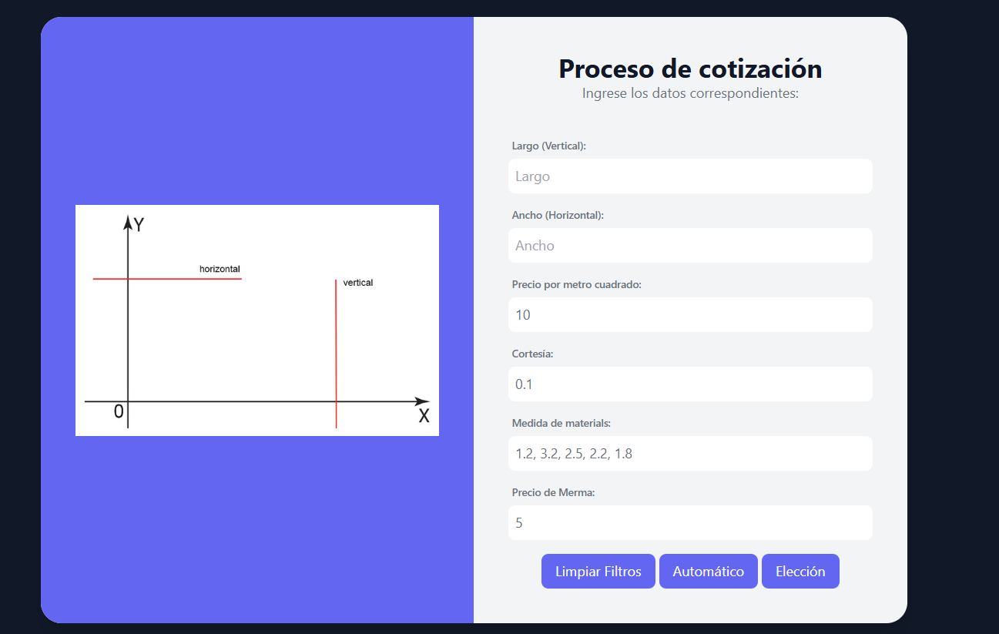

# Waste - Deploy Exit
Calcular merma - Publiarte by wilder Torres - practice Innovosoft
Este fue tambien uno de los proyectos basicos que llevo a cabo en Innovosoft en mis practicas preprofesionales
el proyecto es muy sencillo consiste en calcular la Merma o desperdicio de Banners en base a parametros como:
* Precio de Merma 
* Horizontal
* Vertical 
* Cortesia 
* Precio * m2
* Medidas de materiales
# Lenguajes
* Javascript
* Php 

# Images
 

